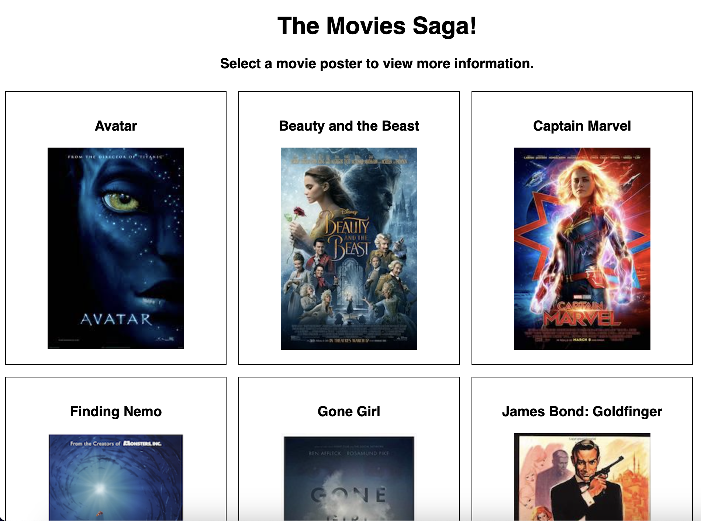
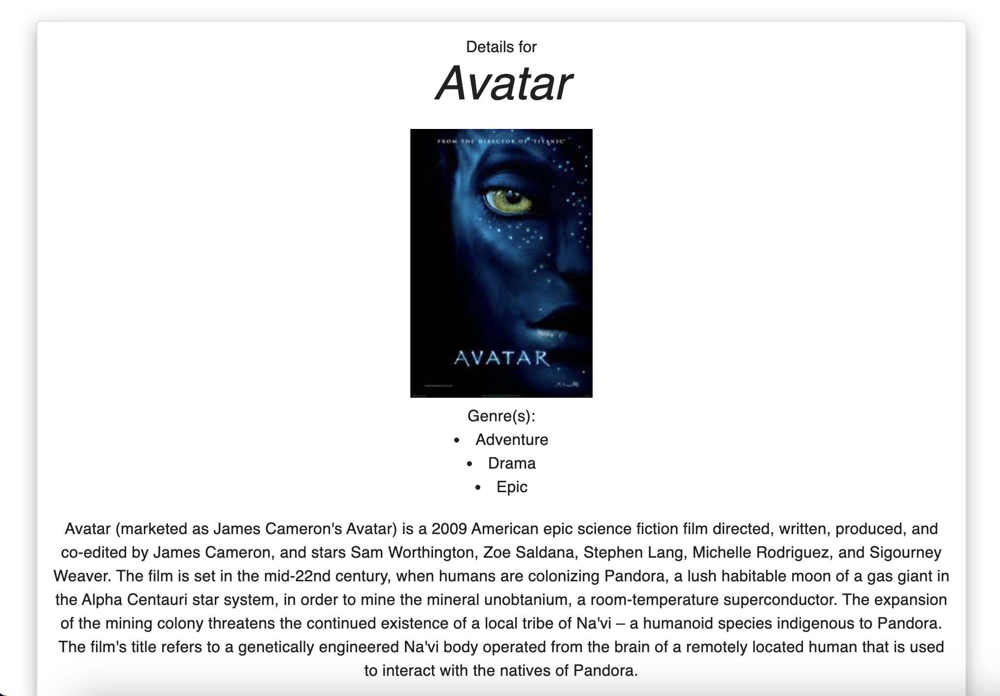
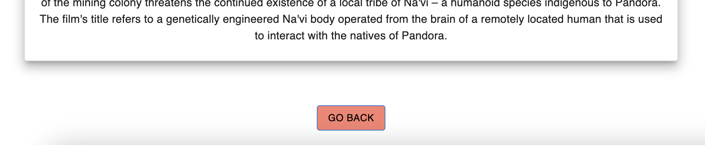

# PROJECT NAME

Weekend Movie Sagas

## Description

This web application displays a collection of movies. Users can select a poster to view a description and the genre(s) of the movie. 

## Preview
 
 
 
## Duration

A few days of work over 1 week.

### Prerequisites

- Node.js
- Nodemon
- React
- Redux
- Postgres
- Postico

## Installation

1. Open the built-in terminal in your editor of choice. I use Visual Studio Code.
2. Run `npm install nodemon --global`
3. Run `npm install`
4. Run `npm install redux@4 react-redux@7 redux-logger@3` 
5. Run `npm install @mui/material @emotion/react @emotion/styled`
6. In Postico, create a database named `saga_movies_weekend`
7. Run the queries from `database.sql` on the `saga_movies_weekend` database
8. Open a new tab of the terminal and enter `npm run server`
9. In a different tab of the terminal, enter `npm run client`
10. A browser window should open automatically.

## Usage

1. Browse the selection of movies. Click a poster to view more information
2. To go back to the list of movies, click the back button below the movie description. 
3. That's it!

## Built With
React, Redux, MUI, Node.js, Axios, Nodemon, Postgres, Postico.

## Acknowledgement
Thanks to [Prime Digital Academy](www.primeacademy.io) for teaching me the skills required to make this application! 

## Support
If you have suggestions or issues, please email me at leighh.stephenson@gmail.com

Thanks for viewing!